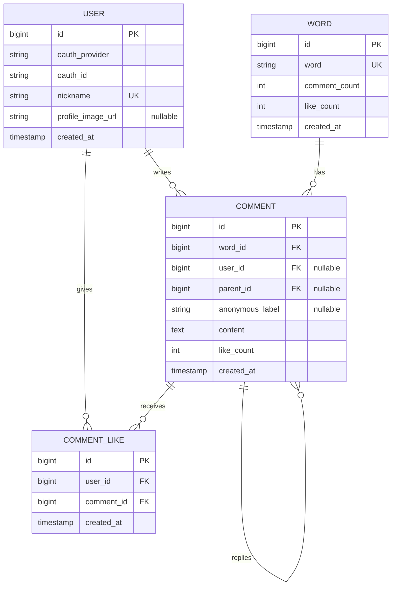

# 다너 ERD

> 데이터 모델 명세서 v0.1

## 다이어그램

---

## 테이블 상세

### USER
서비스 회원. OAuth(구글) 기반. 비회원도 댓글은 가능하므로 모든 댓글이 USER에 연결되진 않음.

| 컬럼 | 타입 | 제약 | 비고 |
|------|------|------|------|
| id | BIGINT | PK, AUTO | |
| oauth_provider | VARCHAR(20) | NOT NULL | "google" (v2부터 "kakao" 등) |
| oauth_id | VARCHAR(100) | NOT NULL | 프로바이더 측 사용자 ID |
| nickname | VARCHAR(20) | UNIQUE, NOT NULL | 2~12자, 가입 시 입력 |
| profile_image_url | VARCHAR(500) | NULLABLE | OAuth에서 받아올 수 있음 |
| created_at | TIMESTAMP | NOT NULL | |

**제약**
- UNIQUE (oauth_provider, oauth_id) — 같은 구글 계정으로 두 번 가입 방지
- 비밀번호 컬럼 없음. 자체 인증 안 함.

---

### WORD (단어 방)
정규화된 형태로 저장. "사랑"과 "사랑 "(공백)은 같은 방.

| 컬럼 | 타입 | 제약 | 비고 |
|------|------|------|------|
| id | BIGINT | PK, AUTO | |
| word | VARCHAR(40) | UNIQUE, NOT NULL | 정규화된 형태 |
| comment_count | INT | DEFAULT 0 | 캐싱용 |
| like_count | INT | DEFAULT 0 | 방 전체 좋아요 합 |
| created_at | TIMESTAMP | NOT NULL | 첫 댓글 시각 |

**정규화 규칙**
1. trim (앞뒤 공백 제거)
2. 영문 → lowercase
3. 한글 → NFC 정규화 (자모 분리 방지)
4. 띄어쓰기 포함되면 거부 (validation 단계에서 차단)
5. 길이 제한: 한글 10자, 영문 20자

---

### COMMENT
댓글 = 메인 콘텐츠. 답글은 self-reference로 처리.

| 컬럼 | 타입 | 제약 | 비고 |
|------|------|------|------|
| id | BIGINT | PK, AUTO | |
| word_id | BIGINT | FK → WORD, NOT NULL | |
| user_id | BIGINT | FK → USER, NULLABLE | 비회원이면 NULL |
| parent_id | BIGINT | FK → COMMENT, NULLABLE | NULL = 최상위, 있으면 답글 |
| anonymous_label | VARCHAR(10) | NULLABLE | "익명1", "익명2"… |
| content | TEXT | NOT NULL | 1~1000자 |
| like_count | INT | DEFAULT 0 | 캐싱용 |
| created_at | TIMESTAMP | NOT NULL | |

**규칙**
- 답글 깊이 1단계 제한 (parent_id가 있는 댓글의 parent_id는 항상 NULL인 댓글만)
- user_id IS NULL이면 anonymous_label 필수
- user_id IS NOT NULL이고 anonymous=true 옵션이면 anonymous_label 부여

---

### COMMENT_LIKE
댓글 좋아요. 회원 전용.

| 컬럼 | 타입 | 제약 | 비고 |
|------|------|------|------|
| id | BIGINT | PK, AUTO | |
| user_id | BIGINT | FK → USER, NOT NULL | |
| comment_id | BIGINT | FK → COMMENT, NOT NULL | |
| created_at | TIMESTAMP | NOT NULL | |

**제약**
- UNIQUE (user_id, comment_id) — 한 사람이 같은 댓글에 한 번만

---

### NOTIFICATION (알림)
받은 답글·좋아요 알림.

| 컬럼 | 타입 | 제약 | 비고 |
|------|------|------|------|
| id | BIGINT | PK, AUTO | |
| user_id | BIGINT | FK → USER, NOT NULL | 받는 사람 |
| type | VARCHAR(20) | NOT NULL | reply / like |
| word_id | BIGINT | FK → WORD, NOT NULL | 어느 방에서 |
| comment_id | BIGINT | FK → COMMENT, NOT NULL | 내 어느 댓글에 |
| actor_user_id | BIGINT | FK → USER, NULLABLE | 비회원이면 NULL |
| actor_label | VARCHAR(10) | NULLABLE | 비회원이면 "익명N" |
| preview | VARCHAR(100) | NULLABLE | type=reply일 때 본문 미리보기 |
| is_read | BOOLEAN | DEFAULT false | |
| created_at | TIMESTAMP | NOT NULL | |

---

### ANONYMOUS_SESSION (비회원 세션)
같은 방 내 익명 라벨 일관성 유지용.

| 컬럼 | 타입 | 제약 | 비고 |
|------|------|------|------|
| id | BIGINT | PK, AUTO | |
| token | UUID | UNIQUE, NOT NULL | 클라이언트가 보관 |
| word_id | BIGINT | FK → WORD, NOT NULL | |
| label | VARCHAR(10) | NOT NULL | "익명1", "익명2"… |
| created_at | TIMESTAMP | NOT NULL | |

**제약**
- UNIQUE (token, word_id) — 한 토큰은 한 방에서 한 라벨만

---

## 인덱스

| 테이블 | 컬럼 | 용도 |
|--------|------|------|
| WORD | word | UNIQUE, 단어 검색 핵심 |
| COMMENT | word_id, created_at DESC | 방 진입 시 최신순 |
| COMMENT | word_id, like_count DESC | 인기순 정렬 |
| COMMENT | user_id, created_at DESC | 프로필 조회 |
| COMMENT | parent_id | 답글 조회 |
| COMMENT_LIKE | (user_id, comment_id) | UNIQUE |
| NOTIFICATION | user_id, created_at DESC | 알림 조회 |
| NOTIFICATION | user_id, is_read | 안 읽은 알림 카운트 |

---

## 인기 단어 TOP 3 집계

**옵션 A (추천)**: 매 시간 배치
- 24시간 내 새 댓글 수 기준
- `popular_word_daily` 테이블에 (word_id, comment_count, calculated_at) 저장
- 홈 API는 이 테이블에서 TOP 3 조회

**옵션 B**: Redis ZSet sliding window (구현 복잡, MVP 이후)
